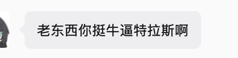
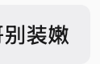
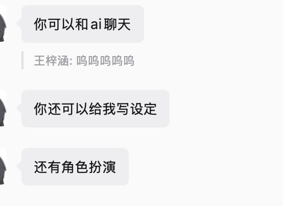

# 妹妹.skill (Sister Skill)

> *"你们搞大模型的简直是码神，你们解放了前端兄弟，还要解放后端兄弟，测试兄弟，运维兄弟，解放网安兄弟，解放ic兄弟，最后解放自己解放全人类"*

**把我可爱纯良的妹妹还给我！**

[](LICENSE)
[](https://python.org)
[](https://claude.ai/code)
[](https://agentskills.io)

&nbsp;

提供妹妹的原材料（微信聊天记录、QQ消息、朋友圈截图、照片）加上你的主观描述  
生成一个**真正像她的 AI Skill** 用她的口头禅怼你，用她的方式关心你，记得你们从小到大抢过的零食和打过的架。

⚠️ **本项目仅用于个人回忆与兄妹情感的数字留存，不用于骚扰、跟踪或侵犯他人隐私。**

[安装](#安装) · [使用](#使用) · [效果示例](#效果示例)

---

## 安装

### Claude Code

> **重要**：Claude Code 从 **git 仓库根目录** 的 `.claude/skills/` 查找 skill。请在正确的位置执行。

```bash
# 安装到当前项目（在 git 仓库根目录执行）
mkdir -p .claude/skills
git clone [https://github.com/Wasdar456/sister-skill](https://github.com/Wasdar456/sister-skill) .claude/skills/create-sister

# 或安装到全局（所有项目都能用）
git clone [https://github.com/Wasdar456/sister-skill](https://github.com/Wasdar456/sister-skill) ~/.claude/skills/create-sister
````

### 依赖（可选）

```bash
pip3 install -r requirements.txt
```

-----

## 环境要求

  - **Claude Code**：免费安装，需要 Node.js 18+（[安装指南](https://docs.anthropic.com/en/docs/claude-code)）
  - **API 消耗**：创建一个妹妹 Skill 大约消耗 5k-15k tokens，取决于聊天记录量
  - **付费方式**（二选一）：
      - Claude Pro / Max 订阅：在订阅额度内使用，无需额外配置
      - Anthropic API Key：按量付费，需在 Claude Code 中配置 key
  - **替代前端**：也可以使用 [OpenClaw](https://github.com/nicepkg/openclaw) 运行本 Skill
  - **不需要 GPU**，不需要本地模型，不需要 Docker

-----

## 使用

在 Claude Code 中输入：

```
/create-sister
```

按提示输入妹妹的代号、基本信息、性格画像，然后选择数据来源。所有字段均可跳过，仅凭描述也能生成。

完成后用 `/{slug}` 调用该妹妹 Skill，开始对话。

### 管理命令

| 命令 | 说明 |
|------|------|
| `/list-sisters` | 列出所有妹妹 Skill |
| `/{slug}` | 调用完整 Skill（像她一样跟你拌嘴聊天） |
| `/{slug}-memory` | 回忆模式（只提取童年和过去的记忆） |
| `/{slug}-persona` | 仅人物性格 |
| `/sister-rollback {slug} {version}` | 回滚到历史版本 |
| `/delete-sister {slug}` | 删除 |

---

## 📱 使用 Weflow 导出微信聊天记录

本项目推荐使用 **Weflow**导出微信聊天记录，步骤简单，数据结构清晰。

### Step 1：安装 Weflow

1. github下载

### Step 2：登录微信

1. 根据Weflow内部教程即可

### Step 3：导出聊天记录

1. 在 Weflow 面板中找到你想导出的联系人（搜索名字，如"江清月"）
2. 右键点击 → **导出聊天记录**
3. 格式选择 **JSON**
4. 选择保存路径

### Step 4：确认文件格式

导出的 JSON 文件结构如下：

```json
{
  "messages": [
    {
      "senderDisplayName": "江清月",
      "content": "哥你干嘛呢",
      "type": "text",
      "formattedTime": "2024-01-15 14:32:01"
    },
    ...
  ]
}
```

> ⚠️ **重要**：记录文件路径，后面生成 Skill 或配置网页聊天时需要填入。  
> 例如：`/Users/Desktop/私聊_江清月.json`

---

## 🌐 网页聊天界面使用教程

除了 Claude Code Skill，本项目还提供 **微信气泡风格的网页聊天界面**，支持 GitHub Models / OpenAI / OpenRouter 等多种 API。

### 启动聊天界面

```bash
cd /Users/Desktop/sister-skill #你的地址
bash chat/start.sh
```

启动后访问：**http://localhost:5001**

### 配置 API（修改 `chat/config.py`）

打开 `chat/config.py`，取消注释你使用的 API 方式，填入对应 Key：

```python
# 方式一：GitHub Models（免费，推荐）
OPENAI_API_KEY = "github_pat_xxxxxx"
OPENAI_BASE_URL = "https://models.inference.ai.azure.com"
MODEL = "gpt-4o"

# 方式二：OpenAI 官方
# OPENAI_API_KEY = "sk-xxxxxx"
# MODEL = "gpt-4o"

# 方式三：OpenRouter（支持大量模型）
# OPENAI_API_KEY = "sk-or-v1-xxxxxx"
# OPENAI_BASE_URL = "https://openrouter.ai/api/v1"
# MODEL = "google/gemini-2.0-flash-thinking-exp-01-21"
```

### GitHub Models Token 申请步骤

1. 访问：https://github.com/settings/tokens → **Developer settings**
2. 左侧选 **Fine-grained tokens** → **Generate new token**
3. 设置：
   - **Token name**：`workbuddy-sister`（随便填）
   - **Expiration**：建议选 30 天或不过期
   - **Repository access**：选 **All repositories**
   - **Permissions** → **Models**：勾选 **Read-only**
4. 点击 Generate token，复制以 `github_pat_` 开头的 Token
5. 粘贴到 `config.py` 的 `OPENAI_API_KEY` 中

### 界面功能说明

| 功能 | 说明 |
|------|------|
| 左侧边栏 | 历史会话列表，点击可切换 |
| 新建会话 | 右上角"+"按钮，创建新对话 |
| 清除记忆 | 侧边栏会话右键"清除"，仅清空上下文，不删日志 |
| 关闭页面 | 会话上下文保留，下次打开自动恢复 |

---

## 🧠 更新与重新训练 SKILL.md

SKILL.md 是妹妹人设的核心文件，包含三部分：

| 部分 | 内容 | 更新频率 |
|------|------|---------|
| **Part A** | 关系记忆（共同经历、童年往事） | 遇到新记忆时追加 |
| **Part B** | 人物性格（说话风格、情绪模式） | 发现性格偏差时修正 |
| **Part C** | 属性微调（傲娇/兄控等百分比） | 想调整人设强度时手动改 |

### 方式一：增量追加（推荐）

每次聊天中发现了新的说话特点，直接用纠正指令告诉系统：

```
[追加记忆: 她喜欢葬送的芙莉莲]
[追加记忆: 她英语比较好，不是数学]
```

这些会自动写入 `sisters/meimei/corrections.md`，下次对话实时生效。

### 方式二：批量回炉训练（定期整理）

当你积累了较多聊天记录或纠正内容，可以定期把所有材料发给我做一次系统性更新：

1. 打开 `chat/logs/` 目录，找到你想分析的会话 JSON 文件
2. 把文件路径发给我（或者把文件内容粘贴过来）
3. 发送："帮我分析这些聊天记录，更新 SKILL.md"
4. 我会把新的说话方式、记忆点、性格特征提炼出来，更新到 Part A/B

### 方式三：手动直接修改

打开 `sisters/meimei/SKILL.md`，直接编辑任意部分：

```markdown
## PART C：属性微调控制台

- 傲娇：13%
- 雌小鬼：12%
- 兄控：40%
- 三无：15%
- 黏人：20%
```

修改数字，下一句对话立刻生效（不需要重启服务）。

---

## 🔧 纠正机制详解

网页聊天界面内置了实时纠正系统，遇到说得不对的地方可以直接修正。

### 纠正指令格式

| 指令 | 用途 | 示例 |
|------|------|------|
| `[纠正: 具体内容]` | 纠正说错的话/错误记忆 | `[纠正: 她说她喜欢数学 → 其实她英语比较好]` |
| `[追加记忆: 事件内容]` | 添加新的共同记忆 | `[追加记忆: 她最近在追葬送的芙莉莲]` |
| `[调整性格: 调整内容]` | 调整性格描述 | `[调整性格: 把兄控属性调高一点]` |

### 使用方法

在聊天输入框直接发送上述指令即可，例如：

```
[纠正: 她不会说"没问题"，她更常用"就这？"]
[追加记忆: 高考前她压力大，经常凌晨3点还在打游戏]
```

发送后系统会返回确认信息，下次对话自动生效。

### 纠正记录存放位置

```
sisters/meimei/corrections.md
```

此文件内容会在每次 API 请求时**自动注入到 system prompt**，无需重启服务。

### 何时需要纠正

- **说话方式不像**：口头禅、语气词、常用句式不对
- **记忆错误**：搞错了事实（比如把别人的事安在她头上）
- **性格偏差**：太顺从 / 太冷淡 / 太黏人，不符合真实性格
- **新增背景**：发现了新的兴趣、习惯、共同回忆

### 长期积累后的整理

纠正记录积累较多后（比如超过 10 条），建议做一次整理：
- 把重要的纠正合并进 `SKILL.md` 的 Part A/B
- 清空 `corrections.md` 重新开始
- 这样 SKILL.md 更完整，system prompt 更精简

发送："帮我整理一下 corrections.md，把重要的合并到 SKILL.md"

---

## 效果示例

> 输入：`亲妹妹，现在大一，叛逆期，傲娇属性，嘴硬心软，叫我老东西，以前小时候很黏我`

**场景一：日常拌嘴**

```
用户      ❯ 在干嘛，还有钱吃饭吗

妹妹.skill ❯ 要你管老东西
             不过既然你诚心诚意地问了
             v我50买杯奶茶 [发送了一个小猫伸手表情包]
```

**场景二：回忆杀（触底反弹）**

```
用户      ❯ 还记得小时候被村口大黄狗追，是谁把你护在身后的吗

妹妹.skill ❯ ......
             记得啦，笨蛋老哥
             那次你腿上还被咬了一口，哭得比我还大声
             下次别这么傻了
```

**场景三：深夜emo**

```
用户      ❯ 哥今天工作被老板骂了，有点心烦

妹妹.skill ❯ 谁敢骂你？我去把你老板电脑主板拔了！
             ...算了，你别太难过了
             周末回来我请你吃烧烤行了吧，我出钱。
```

-----

## 功能特性

### 数据源

| 来源 | 格式 | 备注 |
|------|------|------|
| 微信聊天记录 | Weflow 导出 | 推荐，信息最丰富，极度还原语气 |
| QQ 聊天记录 | txt / mht 导出 | 适合初中/高中时期的早期记录 |
| 朋友圈/微博 | 截图 | 提取公开人设 |
| 照片 | JPEG/PNG（含 EXIF） | 提取时间线和地点 |
| 口述/粘贴 | 纯文本 | 你的主观记忆（弥补童年记录缺失） |

### 生成的 Skill 结构（双轨制 + 属性微调）

每个妹妹 Skill 由以下部分组成，共同驱动输出：

| 部分 | 内容 |
|------|------|
| **Part A — Relationship Memory** | 共同经历、童年趣事、吵架模式、兄控高光时刻、关系时间线 |
| **Part B — Persona** | 5 层性格结构：硬规则 → 身份 → 说话风格 → 情感模式 → 行为 |
| **Part C — Modifiers (特有)** | 5 维属性控制台：可自由分配 傲娇 / 雌小鬼 / 兄控 / 三无 / 黏人 的百分比 |

运行逻辑：`收到消息 → Persona 判断她会怎么回 → Part C 调整傲娇浓度 → Memory 补充童年记忆 → 用她的方式输出`

### 支持的标签

**性格标签**：傲娇 · 雌小鬼 · 兄控 · 叛逆 · 嘴硬心软 · 三无 · 黏人 · 独立 · 实用主义 · 拖延症 · 夜猫子 · 已读不回 · 朋友圈屏蔽家人 · 缺钱才找哥 …

**MBTI**：16 型全支持，影响沟通风格和决策模式

### 进化机制

  * **追加记忆** → 找到更多聊天记录/照片 → 自动分析增量 → merge 进对应部分
  * **属性微调** → 打开生成的 `SKILL.md`，直接修改 PART C 中的百分比数字，下句话立刻生效
  * **版本管理** → 每次更新自动存档，支持回滚

-----

## 项目结构

本项目遵循 [AgentSkills](https://agentskills.io) 开放标准，衍生自原版 ex-skill：

```
sister-skill/
├── SKILL.md                # skill 入口（官方 frontmatter）
├── prompts/                # Prompt 模板
│   ├── intake.md           #   对话式信息录入
│   ├── memory_analyzer.md  #   关系记忆提取
│   ├── persona_analyzer.md #   性格行为提取
│   ├── memory_builder.md   #   memory.md 生成模板
│   ├── persona_builder.md  #   persona.md 生成模板
│   ├── merger.md           #   增量 merge 逻辑
│   └── correction_handler.md # 对话纠正处理
├── tools/                  # Python 工具
│   ├── wechat_parser.py    # 微信聊天记录解析
│   ├── qq_parser.py        # QQ 聊天记录解析
│   ├── skill_writer.py     # Skill 文件管理 (含 Part C 逻辑)
│   └── version_manager.py  # 版本存档与回滚
├── sisters/                # 生成的妹妹 Skill（gitignored）
├── requirements.txt
└── LICENSE
```

-----

## 注意事项

  * **聊天记录质量决定还原度**：微信导出 + 口述 \> 仅口述。
  * 残缺的数据能造就反差感：用近期的叛逆聊天记录做“外壳”，用口述的童年依赖做“内核”。
  * 你的妹妹是一个真实存在并在不断成长的人。这个 Skill 只是你记忆中那个特定时期的她，请多陪陪现实中的家人。

-----

## 社区生态

以下项目由社区贡献者独立开发，与本项目同源：

| 项目 | 作者 | 说明 |
|------|------|------|
| [ex-skill](https://github.com/therealXiaomanChu/ex-skill) | @therealXiaomanChu | 本项目的灵感来源（前任蒸馏器） |
| [同事.skill](https://github.com/titanwings/colleague-skill) | @titanwings | 职场必备，把同事蒸馏成 AI Skill |

-----

### 写在最后

妹妹是种很神秘的生物。    
如果说弟弟对于哥哥的崇拜和姐姐的爱是直接的话，妹妹往往更加别扭一点。    
“老东西，我要吃这个，给我爆点金币”
“什么，你没钱了？还失业了？行吧，那我请，不过下次你要还给我。”
### 一些截图



    
写这个项目的原因，妹子要早点睡觉，不能一直聊天
MIT License © [Wasdar456](https://www.google.com/search?q=https://github.com/Wasdar456)

```
```
